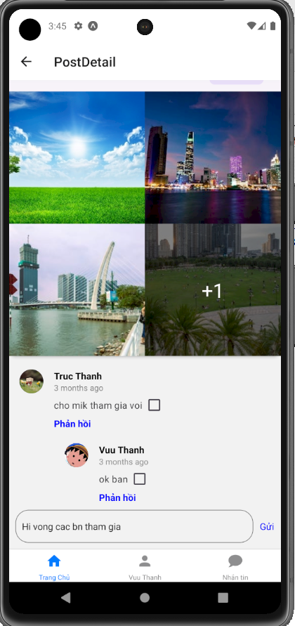

# ReactNativeShareYourTrip

## Overview

**React Native Share Your Trip** is a frontend system that provides an interface for customers to be able to interact with post tasks, reviews, comments, and manage personal information. In addition, users message each other.

## Installation
*This readme contains installations and usages for React Native*

To ensure the project runs, please open the Backend [Share Your Trip](https://github.com/TrucThanh278/ShareYourTrip)

```bash
# Run Backend Share Your Trip
python manage.py runserver your_IPv4_address:8000
```

Next, open the ReactNativeShareYourTrip project and Android Studio.
*Ctrl + C (your_IPv4_address:8000), go to configs folder --> open file APIs.js --> Ctrl + V (URL_BASE) *

```bash
# Run React Native Share Your Trip
Step 1: npm install
Step 2: npm start
```

## Login/Register Interface
<p align="center">
    
    
</p>

## Post/PostDetail Interface
<p align="center">
    
    
    
</p>

## Profile Interface
<p align="center">
    
    
    
    
</p>

## Chat Interface
<p align="center">
    
    
</p>

## Statistics report of admin Interface
<p align="center">
    
    
</p>
